# 🧙🏻‍♂️ KLEPTOMAGIC 🧙🏻‍♂️
---
## 🌐 Sitio Web del Proyecto

- 🔗 **Sitio principal (GitHub Pages - UCM FDI):**  
  [https://ucm-fdi-disia.github.io/KleptoMagic/](https://ucm-fdi-disia.github.io/KleptoMagic/)

- 🕸️ **Mirror alternativo (por si la principal tarda):**  
  [https://javicace.github.io/KleptoWeb/](https://javicace.github.io/KleptoWeb/)

---
## Equipo de desarrollo: Team 2
### Integrantes:
- Gabriel Barroso Bueno
- Zhuokai Zhu
- Sergio Yago Juárez
- Javier Cáceres
- Sergio Croche Trigo
- Daniil Sosiedka
- Mauro Martínez
- Diego Martín García
- Davide Chen
## *Game Design Document*
## 📋 Índice
1. [Resumen](#1-resumen)
   - 1.1 [Descripción](#11-descripción)
   - 1.2 [Género](#12-género)
   - 1.3 [Público objetivo](#13-público-objetivo)
   - 1.4 [Plataforma](#14-plataforma)
2. [Mecánicas](#2-mecánicas)
   - 3.1 [Controles](#21-controles)
   - 3.2 [Movimientos](#22-movimientos)
   - 3.3 [Personajes](#23-personajes)
   - 3.4 [Estadísticas del personaje](#24-estadísticas-del-personaje)
   - 3.5 [Armas](#25-armas)
   - 3.6 [Objetos](#26-objetos)
   - 3.7 [Piso](#27-piso)
   - 3.8 [Enemigos](#28-enemigos)
3. [UI](#3-ui)
   - 3.1 [Menús](#31-menús)
   - 3.2 [Elementos](#32-elementos)
4. [Estética](#4-estética)
5. [Referencias](#5-referencias)
6. [Testing](#6-testing)
## 1. Resumen
### 1.1 Descripción
Es un roguelike de acción top-down con estilo pixel-art, en el cual se juega como uno de varios personajes pertenecientes a una banda de ladrones completamente mundanos en un mundo lleno de magia.
### 1.2 Género
Roguelike, acción, top-down.
### 1.3 Público objetivo
Mayores de 10 años, amantes de los juegos roguelike y acción.
### 1.4 Plataforma
PC Windows 10 y superior.
## 2. Mecánicas
### 2.1 Controles
El personaje se mueve con el stick izquierdo del GamePad o con WASD.  
Para apuntar se usa el stick derecho o con el ratón.  
Con el click izquierdo se ataca a la dirección que se ha apuntado.  
### 2.2 Movimientos
El usuario puede controlar el personaje en ocho direcciones: arriba, abajo, derecha, izquierda y los diagonales.
### 2.3 Personajes
Existen cuatro personajes para elegir:
| Personaje     | Imagen                | Descripción     |
|---------------|-----------------------|-----------------|
| Knight        | 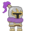  |  Ataques a melé, cuerpo a cuerpo |
| Rogue         | 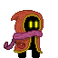 | Ataques a distancia, con una velocidad medio alto, pero daño medio |
| Hunter        | 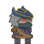 | Ataques a media distancia, con una velocidad bajo, pero alto en daño de ataque  |
| Alchemist     | 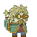 | Ataques a distancia, con una velocidad media, pero su daño es en área |
### 2.4 Estadísticas del personaje
El personaje tiene los siguientes estadísticas, que se pueden mejorar a lo largo del juego:
- Vida.
- Escudo.
- Velocidad de movimiento.
- Daño de ataque.
- Velocidad de ataque.
### 2.5 Armas
Cada personaje tienen sus propias armas:  
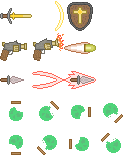
### 2.6 Objetos
Al matar a un enemigo, tienes probabilidad de dropear un objeto que te sube las estadísticas.
Por ejemplo:
| Nombre    | Imagen                | Descripción     |
|---------------|-----------------------|-----------------|
| ChargeHammer        | 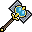  |  Sube dos de vida máxima, dos de daño y dos de velocidad de ataque múltiple |
| FlameSword         | 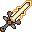 | Sube uno de vida máxima, dos de daño y dos de velocidad de ataque múltiple|
| WoodShield        |    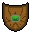    |  Recupera dos de vida, sube 4 de vida máxima y dos de velocidad de ataque múltiple  |

Existen muchísimos más objetos pérdidos en el mundo mágico.
### 2.7 Piso
El juego está compuesto por un piso con distintas salas.   
Las salas están hechas con generación procedural, de esta forma, cada partida que juegas, existe un piso diferente.
### 2.8 Enemigos
Existen varios enemigos peligrosos:
| Enemigo     | Imagen                | Descripción     |
|---------------|-----------------------|-----------------|
| Slime        | 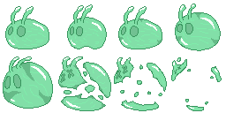  |  Normalmente se encuentran en cantidad, y se mueven lentamente hacia ti |
| Living Armor         | 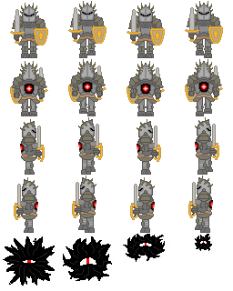 | Solo se mueve en cuatro direcciones, los diagonales no. Para derrotarlo hay que atacar por la espalda |
| Undead Archer     | 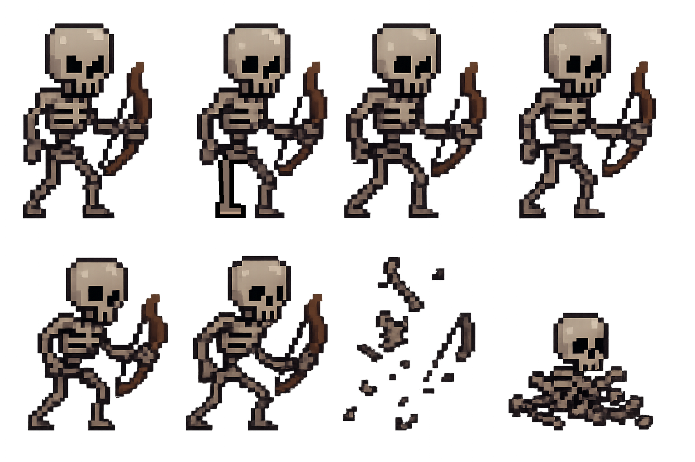  | Enemigo que ataca a larga distancia |
| Boss Wizard     |         | Jefe final, dispara varios proyectiles, de distintas maneras |
## 3. UI
### 3.1 Menús
- Menú principal:   
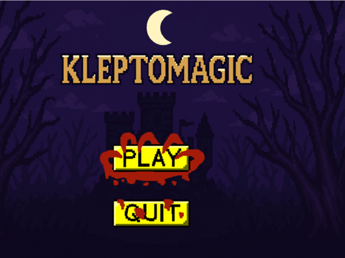
- Menú de selección:    
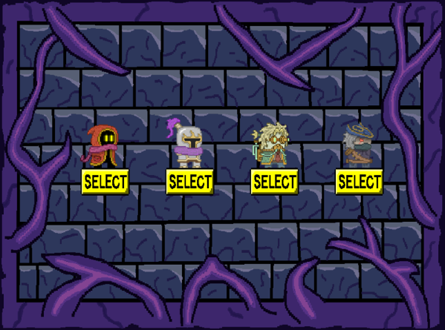
- Menú pausa:   
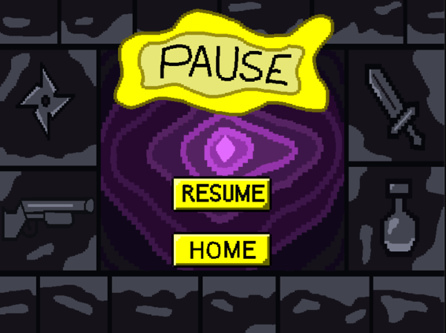
- Tutorial:

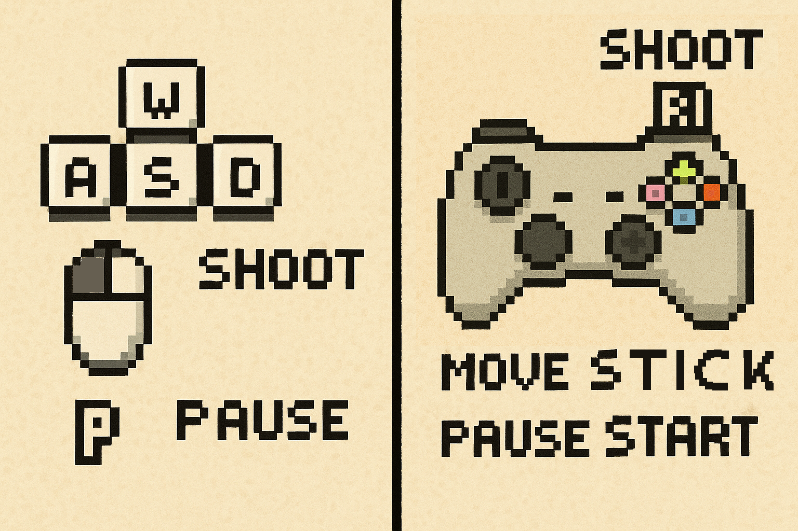
### 3.2 Elementos
| Elemento     | Imagen                |
|---------------|-----------------------|
| Vidas        |   |
## 4. Estética
Es un juego diseñado con imágenes pixelart. 
A su vez los sonidos son de temática siniestra para encajar en el juego, sin embargo existe sonidos auxiliares como pulsar un botón, que hace calmar o hacer reir al jugador, ya que los sustos y temor no es nuestra intención.
## 5. Referencias
- The Binding of Isaac.
- Enter the Gungeon.
- Soul Knight.
- Wizard of Legend.
## 6. Testing
Tabla de datos:
https://docs.google.com/spreadsheets/d/11CAguenY7ZaOqdui6tiNkYHmsIxgpgXR-YCmFzNjeJo/edit?usp=sharing
Recopilacion de todos los Playtest:
https://docs.google.com/document/d/1eL_9Ad7VfhAdRRX01lgQWl4UM0oU4Da4xOc2AgJVt9k/edit?usp=sharing
